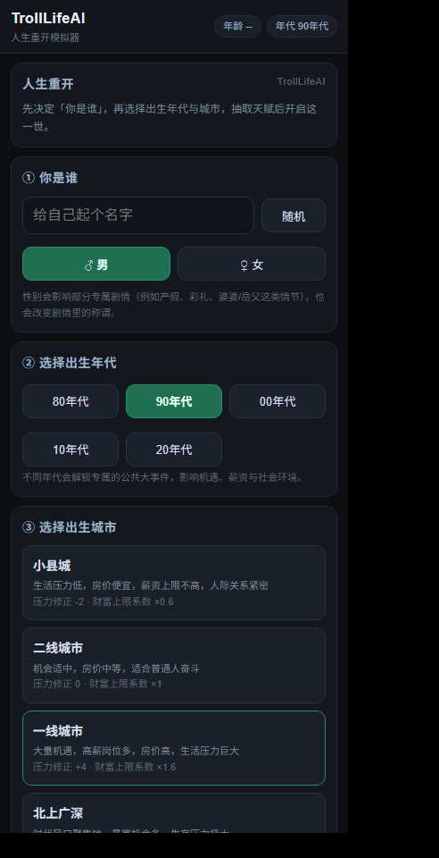
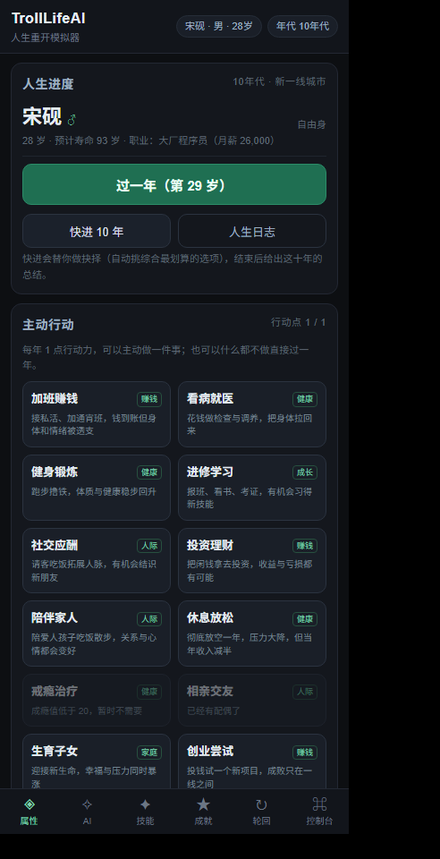
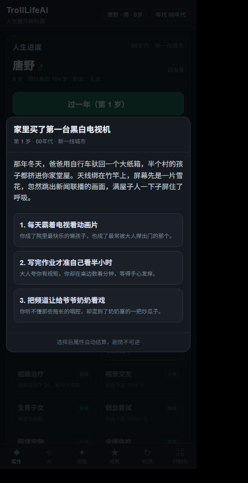
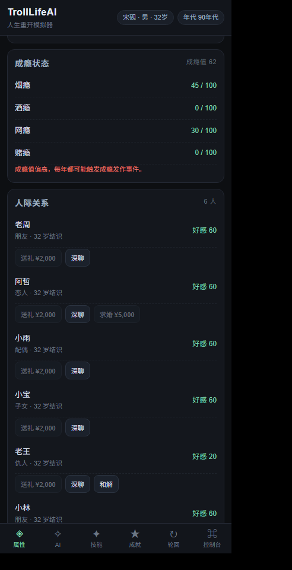
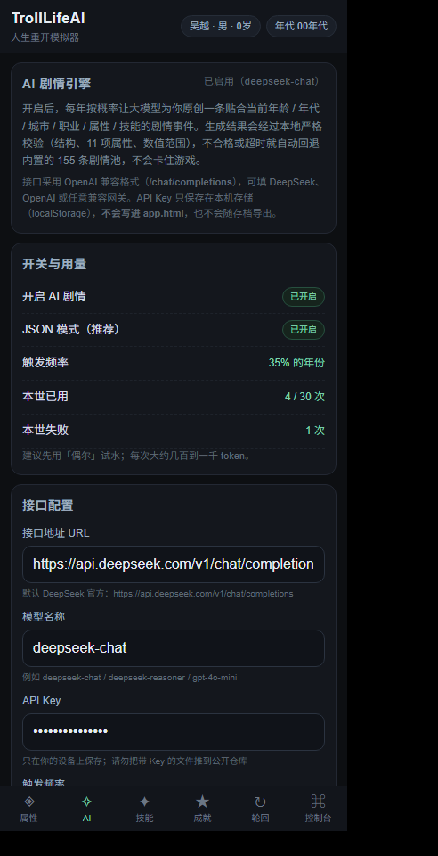
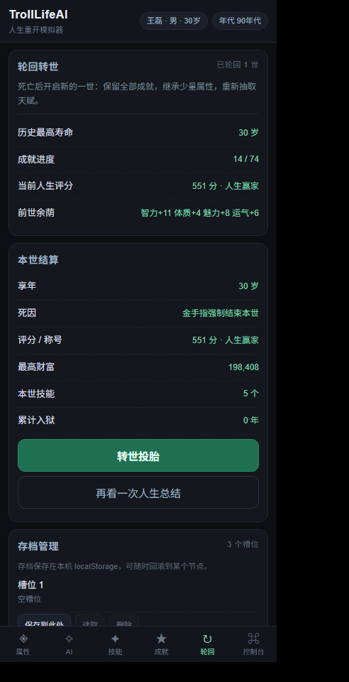
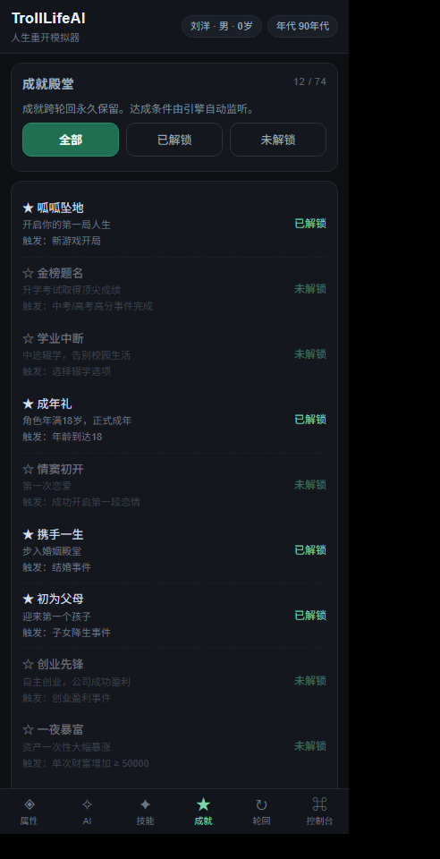
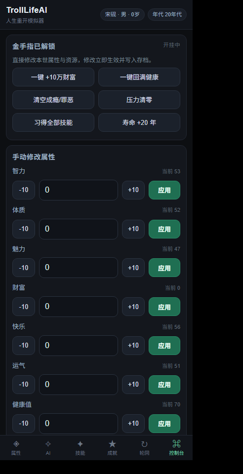
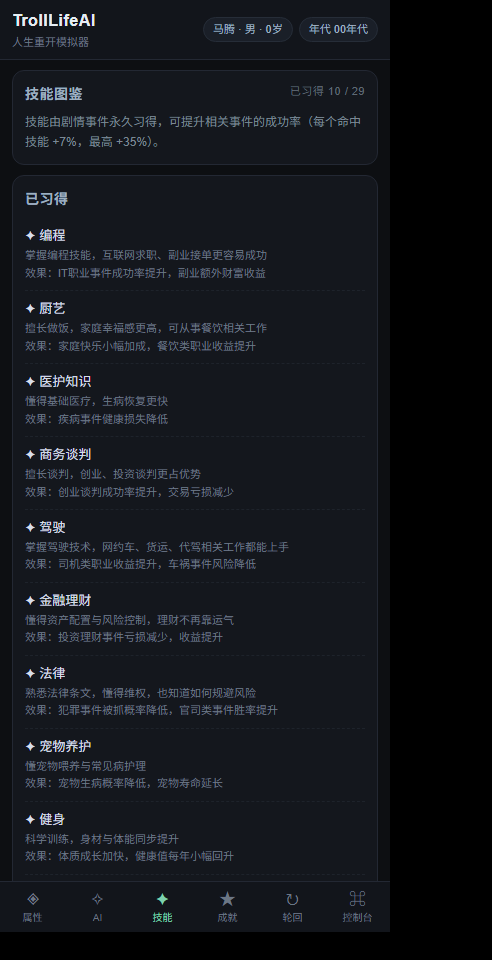
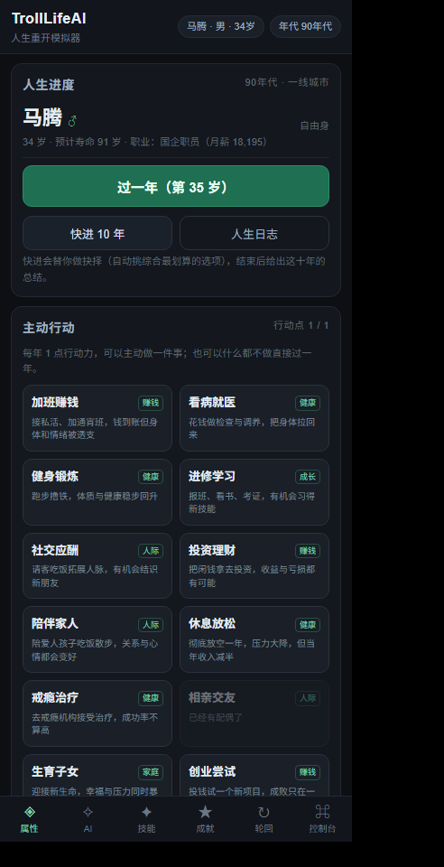

# TrollLifeAI · 人生重开模拟器

> **仓库**：https://github.com/hailanshi/TrollLifeAI ・ **云端编译**：https://github.com/hailanshi/TrollLifeAI/actions
> **已产物**：`TrollLifeAI.ipa`（arm64 / iOS 12+ / ad-hoc 签名 / UIDeviceFamily=[1] / 约 221 KB）——
> 在 Actions 最近一次成功的运行页面底部 **Artifacts → TrollLifeAI-ipa** 即可下载，TrollStore 直接安装。

单机文字人生模拟器：抽天赋 → 选出生年代与城市 → 逐年经历人生事件 → 管理 11 项属性 → 解锁成就 → 死亡后轮回转世。
内置金手指密码 **208526**。全部数据本地持久化（localStorage / 本地文件），**不需要任何后端**。

仓库里同时交付了 **两种前端形态**：

| 形态 | 位置 | 说明 |
| --- | --- | --- |
| **单文件 HTML（主交付）** | `app.html` | HTML + CSS + JS + 数据全内联，双击即玩；iPhone Safari「添加到主屏幕」可当 PWA；也是打包进 iOS App 的那一份 |
| **Flutter 版工程** | `flutter_trolllifeai/` | Provider 状态管理 + 8 个页面 + 33 个 dart 文件，读取 `assets/json` 下同一套数据；**已同步主动行动 / 关系互动 / 人生评分 / 存档槽位 / AI 剧情**全部新玩法 |

以及一套**云端打包流水线**，把 `app.html` 装进极简 WKWebView 壳，产出 TrollStore 可直接安装的 `TrollLifeAI.ipa`。

---

## 一、交付物清单

```
项目1/
├─ app.html                          ★ 单文件游戏（业务 100% 内联，174 KB）
├─ assets/json/                      ★ 合并后的完整 5 份数据（供 Flutter 版与构建使用）
│  ├─ talents.json        44 条（原 20 + 新 24）
│  ├─ achievements.json   74 条（原 27 + 新 47）
│  ├─ skills.json         29 条（原 10 + 新 19）
│  ├─ city.json            9 座（原  5 + 新  4）
│  └─ event.json         155 条（原 35 + 新 120）
├─ talents.json / achievements.json / skills.json / city.json / event.json   ← 原始 5 份文件（未被改动）
├─ src/                              单文件游戏的源码分片（head/body + 5 个 JS 模块，按序内联）
├─ tools/                            构建 · 合并 · 自检 · 文档生成 · 图标 · 截图脚本
├─ docs/
│  ├─ 玩法扩展设计.md                ★ 第一阶段：玩法扩展设计文档（含第二轮玩法增强）
│  ├─ AI接入说明.md                  ★ AI 剧情接入：三步配置 / 安全 / 提示词 / 排错
│  ├─ 新增事件清单.md                120 条新增事件完整清单（含全部选项与标记）
│  ├─ 数据总览.md                    数据规模 / 年龄分布 / 标记统计 / 新增天赋技能成就城市
│  ├─ 打包教程.md                    ★ 傻瓜版打包教程（GitHub → Actions → ipa → TrollStore）
│  └─ screenshots/                   390px 真机宽度界面截图
├─ ios-shell/TrollLifeApp/           ★ WKWebView 壳工程（只做容器，零业务逻辑）
│  ├─ main.m / AppDelegate.h/.m / ViewController.h/.m
│  ├─ Info.plist / project.yml
│  └─ Resources/ index.html + AppIcon60x60@2x.png + @3x.png
├─ .github/workflows/build-ipa.yml   ★ 云端 macOS 编译出 ipa
└─ flutter_trolllifeai/              Flutter 版工程（含 pubspec.yaml 的 json 资源声明）
```

---

## 二、马上开始玩

```powershell
# 双击 app.html 即可；或本地起个静态服务（可选）
start app.html
```

浏览器 / iPhone Safari 都能跑；数据存在 localStorage，关掉再打开继续上一世。

---

## 三、玩法一览

**属性（11 项）**：智力、体质、魅力、财富、快乐、运气、健康值、成瘾值、名声值、压力值、罪恶值

**八大系统**
1. **人际关系**：朋友 / 恋人 / 配偶 / 子女 / 仇人 + 0-100 好感度，绝交、出轨、亲人离世、老友重逢
2. **职业**：20+ 岗位，升职 / 失业 / 跳槽 / 被裁员 / 创业破产，薪资随**城市 × 技能 × 智力**浮动
3. **医疗**：大病手术、住院、遗传病、心理咨询、抑郁焦虑；健康告急且有钱时自动就医调养（财富能换命）
4. **消费购物**：买房、买车、奢侈品、理财保险、资产负债管理、负债计息
5. **年代事件**：80 / 90 / 00 / 10 / 20 五个年代专属公共大事件，只在该年代才能抽到
6. **犯罪加强**：入狱服刑（跳过年份、无收入）→ 减刑 → 越狱念头 → 出狱 → 案底惩罚
7. **宠物生命周期**：收养 → 生病 → 繁育 → 走失 → 衰老 → 离世
8. **成瘾扩展**：烟瘾 / 酒瘾 / 网瘾 / 赌瘾，成瘾值 ≥60 强制触发成瘾发作，戒断有真实代价

**特色**
- **主动行动系统**：每岁 1 点行动力，14 种行动（加班赚钱 / 看病 / 健身 / 进修 / 社交 / 投资 / 陪伴家人 / 休息 / 戒瘾 / 相亲 / 生育 / 创业 / 陪宠物 / 体检），在"赚钱、健康、成长、人际、家庭"之间做取舍
- **关系互动**：对每个关系可送礼 / 深聊 / 和解 / 求婚（每人每年 1 次），好感度影响求婚与和解成败
- **AI 剧情**（可选）：接入 OpenAI 兼容接口（默认 DeepSeek），每年按概率让大模型**原创**一条贴合当前年龄/年代/城市/属性/技能的剧情；本地严格校验 + 失败自动回退内置 155 条剧情池，Key 只存本机
- **人生评分与称号**：死亡结算给出量化评分与「传奇人生 / 人生赢家 / 小有成就 / 平凡一生 / 碌碌无为 / 悲惨人生」称号，可看评分明细
- **存档管理**：3 个槽位保存/读取/删除 + 存档文本导出/导入
- 死亡 → 人生总结 → 轮回转世，继承上一世 智力/体质/魅力/运气 各 8%，成就跨世永久保留
- 成就自动监听解锁（74 个）
- **金手指控制台**：密码 `208526` 解锁，可改全部属性、一键 +10 万财富、回满健康、清空成瘾罪恶、习得全部技能、解锁全部成就

---

## 四、界面预览（无头浏览器真实渲染，390px iPhone 宽度）

| 开局页 | 属性 + 主动行动 | 事件弹窗 | 人际关系互动 |
| --- | --- | --- | --- |
|  |  |  |  |

| AI 剧情设置 | 人生评分结算 | 成就页 | 金手指控制台 |
| --- | --- | --- | --- |
|  |  |  |  |

| 技能页 | 长时间线属性页 | App 图标 |
| --- | --- | --- |
|  |  |  |

> 这些截图由 `node tools/make-narrow-shots.js` + `powershell -File tools/shot.ps1` 生成：
> 把 `app.html` 放进 390px 宽的 iframe 里真实跑一遍（自动选年代城市、抽天赋、推进几十岁、解锁成就、输密码解锁控制台、配好 AI），
> 同时统计横向溢出 —— **全部 10 个场景横向溢出元素数 = 0**。

---

## 五、接入 AI 剧情（可选，3 步）

1. 打开游戏 → 底部 **AI** 页签
2. 填 **接口地址**（默认 `https://api.deepseek.com/v1/chat/completions`）、**模型**（默认 `deepseek-chat`）、**API Key**
3. 点 **测试连接** → 成功后打开「开启 AI 剧情」

- 触发频率建议先选「偶尔 15%」，每世上限默认 30 次
- AI 返回会经过**本地严格校验**（11 项属性齐全、整数、数值范围、越界夹取），不合格或超时**自动回退内置剧情池**
- **API Key 只存本机 localStorage，不写进 `app.html`、不随存档导出**；自检脚本会断言 `app.html` 内不存在任何 `sk-` 形式的 Key
- App 内走壳的 `nativeHttp` POST 原生通道绕开 `file://` 的 CORS；电脑浏览器里直连若接口不允许跨域会失败（浏览器策略）

细节见 `docs/AI接入说明.md`。

---

## 六、改成你自己的版本（重建流程）

```powershell
node tools/merge-json.js     # 1. 合并 5 份 JSON（原始内容保留 + 新增追加 + 严格校验，出错即中止）
node tools/build-html.js     # 2. 生成 app.html 并同步到 ios-shell/TrollLifeApp/Resources/index.html
node tools/selfcheck.js      # 3. 48 项交付自检（iOS 兼容铁律 / onclick 全局函数 / 数据完整性 …）
node tools/test-headless.js  # 4. 无头模拟 400 局人生 + 界面层端到端演练
node tools/check-flutter.js  # 5. Flutter 工程静态自检（无 SDK 环境下的替代验证）
node tools/gen-docs.js       # 6. 重新生成数据文档
node tools/make-narrow-shots.js   # 7. 生成 390px 演示页
powershell -ExecutionPolicy Bypass -File tools/shot.ps1          # 8. 截图 + 溢出审计
powershell -ExecutionPolicy Bypass -File tools/make-icons.ps1    # 9. 重新生成不透明图标
```

改数据只动两处：
- **加内容** → 编辑 `build/patches/*.patch.json`（新增部分），再跑 `merge-json.js`；原始 5 份 JSON 永远不被改写
- **改规则 / 改 UI** → 编辑 `src/js/*.js` 或 `src/head.html`、`src/body.html`，再跑 `build-html.js`

---

## 五、打包成 TrollStore 可安装的 ipa

完整步骤见 **`docs/打包教程.md`**。核心流程：

1. 建 GitHub 仓库 → 把整个项目推上去（含隐藏目录 `.github`）
2. Actions 自动在 **macos-15（Xcode 16）** 上跑 `xcodegen` + `xcodebuild`
3. 流水线强制校验：主程序存在（防空壳包）、ipa 内有 `index.html` 与两张图标、用真实退出码判断成败
4. 下载 Artifacts 里的 `TrollLifeAI.ipa` → 用 TrollStore 安装

---

## 六、验证状态（如实说明）

| 项 | 状态 |
| --- | --- |
| 5 份 JSON 严格校验（`JSON.parse` + 结构 + 11 项属性齐全 + 标题去重 + 标记合法） | ✅ 0 错误 0 警告 |
| 原始内容未被修改（深比较 + 快照比对） | ✅ 5/5 通过 |
| 单文件 HTML 内联 JS 语法（`new Function` + `node --check`） | ✅ 通过 |
| 交付自检 87 项（iOS 铁律 / onclick 全局挂载 / 无外部依赖 / 壳无业务 / CI 避坑点 / 标记剥离 / 无嵌入 Key / 剧情逻辑与性别规则） | ✅ 87/87 |
| 引擎逻辑无头模拟（400 局人生、11 项属性完整性、成就解锁、金手指、死亡与轮回） | ✅ 全部通过 |
| 玩法增强层自检（14 种行动、关系互动、评分、3 槽位存档、年龄纠偏、前提校验、名字与性别、快进 10 年） | ✅ 13/13 项 |
| AI 链路自检（配置持久化、结构校验、越界夹取、不合格丢弃、带代码块 JSON 抽取、请求头、成功替换、失败回退本地池） | ✅ 通过 |
| 界面层端到端演练（开局→选年代城市→抽天赋→推进→事件弹窗选选项→六个页面→密码 208526→死亡→转世→存档） | ✅ 通过 |
| 390px iPhone 宽度真实渲染 + 横向溢出审计（10 个场景） | ✅ 溢出元素 0 |
| Flutter 工程静态自检（33 个 dart 文件、import 解析、52 个 Provider 调用全部已定义、玩法要素落地） | ✅ 20/20 |
| 图标 | ✅ 120×120 / 180×180，24bpp **无 Alpha 通道**（不透明） |
| **`.ipa` 产物** | ❌ **本机是 Windows，没有 Xcode / iOS 工具链，无法在本地产出 ipa** |
| Flutter 工程编译 | ❌ **本机没有 Flutter/Dart SDK，只能静态校验；编译需本地 `flutter create .` 后 `flutter run`** |

> 关于 ipa：在 Windows 上「生成」出来的 ipa 一定是假包（没有 arm64 主程序、签名不正确，装上必闪退），
> 所以这里不做假交付，改为给出**可在你电脑上跑通的完整工程 + 云端打包流水线**。
> 或者也可以把工程推到 GitHub，用 Actions 一次性拿到真 ipa。

---

## 七、iOS / WKWebView 兼容铁律落实情况

| 铁律 | 落实方式 |
| --- | --- |
| 动态 DOM 不用 `el.onclick = fn` | 全部使用内联 `onclick="window.ui.xxx()"`，26 个处理函数全部挂在 `window` 上（自检项） |
| 确认弹窗不用闭包回调 | `window.__confirm = {fn, args}` 存全局，「确定」统一走 `window.doConfirmOK()`；能直接执行的按钮直接执行 + toast |
| 弹窗不用 CSS `inset` | 使用 `top/left/right/bottom`；长列表弹窗「标题固定 / 内容独立滚动 / 按钮固定」三段式 |
| 安全区 | 顶栏与底部导航用 `env(safe-area-inset-top/bottom)` 留白 |
| 锁定缩放 | `viewport-fit=cover` + `maximum-scale=1, user-scalable=no`；壳里 `pinchGestureRecognizer.enabled = NO`、双击缩放禁用、`contentInsetAdjustmentNever`；输入框 `font-size:16px` |
| 全逻辑 try-catch + toast 反馈 | 每个业务入口都包 try-catch，任何增删改都有 toast（自检统计 400 局共 2.7 万次反馈） |
| 老语法 JS | 无箭头函数 / 模板字符串 / 可选链 / `??` / `.flat()` / `let`·`const`（自检 6 项） |
| 原生取数通道 | 壳注册 `nativeFetch`（`NSURLSession` 回传文本），页面 `window.apiGetText()` 优先走原生、无通道回退 `fetch`，解析仍在 JS |
| 不用私有 KVC | 壳里没有 `allowFileAccessFromFileURLs` 这类私有 KVC（自检项） |
| 崩溃可查 | 未捕获异常 + 6 个信号处理器写 `Documents/crash.log`，Info.plist 开 `UIFileSharingEnabled` |
